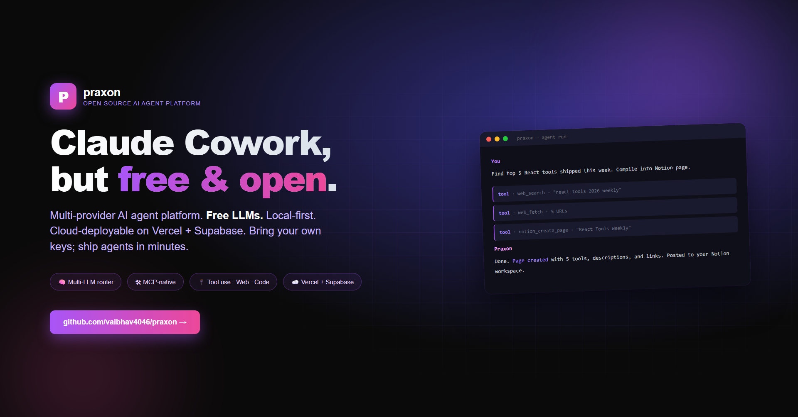

<div align="center">



# Praxon

**Open-source AI agent platform · Free LLMs · Local-first · Cloud-deployable**

Replaces Claude Cowork, Claude Code, and Perplexity Computer. One workspace for chat, code, deep research, and automation.

[](LICENSE)
[](https://nextjs.org)
[](https://supabase.com)

[**Live demo**](https://praxon-hazel.vercel.app) · [GitHub](https://github.com/vaibhav4046/praxon) · [Deploy guide](DEPLOY.md) · [Scale roadmap](SCALE.md)

</div>

---

## What it is

Praxon is a self-hostable AI agent platform that pairs the conveniences of Claude Cowork (skills, projects, MCP, routines) with features the paid platforms don't ship: a full code workspace, deep web research with citations, and goal-driven autonomous agent loops.

Runs on free LLMs (Groq, Gemini, Cerebras, Together, OpenRouter, NVIDIA NIM, Hugging Face, Ollama) or any premium key you bring (Anthropic Claude, OpenAI GPT-4).

Single binary feel. Multi-tenant when you flip on Supabase.

## Features

- **Streaming chat** — 10 LLM providers, auto-fallback, slash commands, voice input, attachments
- **Tool-calling agent** — fs r/w/edit, shell, web search (Tavily/Serper/Brave), HTTP, headless browser (Playwright Chromium), memory r/w
- **Deep Research** — multi-step plan → search → fetch → synthesize with inline `[n]` citations
- **Autonomous Agents** — goal loops that plan, act, iterate until done
- **Code workspace** — Monaco editor + xterm-style terminal + file tree paired with the agent
- **Projects** — isolated workspace, system prompt, memory, backpack, skills, MCP servers per project
- **Backpack** — pin files + notes; auto-injected into every chat in that project
- **Memory** — markdown-backed per-project facts that persist across sessions
- **Skills** — reusable prompt + tool-whitelist combos
- **Routines** — cron-scheduled prompts; background agents that run themselves
- **MCP-native** — connect any Model Context Protocol server (GitHub, Slack, Notion, your own)
- **Theme picker** — 8 colors, sitewide CSS-var driven, persists to `localStorage`
- **Multi-user ready** — Supabase Auth (magic link) + Postgres + RLS, or single-user JSON file fallback

## Architecture

```
app/
  api/
    chat/                    streaming chat + tool calls (ai-sdk v4)
    research/                deep research ndjson stream
    agents/run/              autonomous agent loop ndjson stream
    projects/[id]/           CRUD + memory + backpack
    sessions/                CRUD + search
    skills/ tasks/ mcp/      registries
    workspace/[id]/          file tree, file r/w, exec
    keys/                    live runtime keys editor
    health/                  runtime + provider + storage status
components/
  chat/                      message, composer (voice + uploads + slash commands)
  code/                      Monaco workspace
  brand/                     logo + theme picker
  landing/                   hero + interactive demo
lib/
  llm/providers/             10 LLM providers
  llm/router.ts              availability detection + fallback
  agents/
    orchestrator.ts          streamText w/ tools
    research.ts              deep research generator
    autonomous.ts            agent loop generator
    tools/                   fs, shell, web, browser, memory
  db/                        projects, sessions, messages, skills, tasks, mcp, backpack
                             (Supabase + JSON fallback w/ auto-dispatch via getDbClient)
  supabase/                  ssr client + admin client + auth helpers
  scheduler/runner.ts        node-cron loop
supabase/migrations/0001_init.sql   10 tables + RLS policies
```

## Quick start

```bash
git clone https://github.com/vaibhav4046/praxon.git
cd praxon
pnpm install
pnpm exec playwright install chromium
cp .env.example .env.local
# Add at least one LLM provider key (free options below)
pnpm dev
```

Open http://localhost:3000.

### Free API keys (pick at least one)

| Provider | Free tier | Best for |
|---|---|---|
| [Groq](https://console.groq.com/keys) | ~14k req/day per model | Default; fastest |
| [Gemini](https://aistudio.google.com/apikey) | 15 RPM Flash | Generous, fast |
| [Cerebras](https://cloud.cerebras.ai) | 1M tokens/day | Best quality free |
| [Together](https://api.together.xyz) | $1 credit | Backup |
| [OpenRouter](https://openrouter.ai/keys) | Some `:free` models | Aggregator |
| [Ollama](https://ollama.com) | Local, no key | Offline |

For Deep Research: [Tavily](https://tavily.com) (1000 searches/mo free).

### Multi-user mode (Supabase)

```bash
# Add to .env.local:
NEXT_PUBLIC_SUPABASE_URL=https://xxxxx.supabase.co
NEXT_PUBLIC_SUPABASE_ANON_KEY=eyJhbG...
SUPABASE_SERVICE_ROLE_KEY=eyJhbG...

# Apply schema (Supabase SQL Editor):
cat supabase/migrations/0001_init.sql
```

Restart. `/login` shows magic-link email form. All data routes to Postgres with RLS isolation per user.

## Deploy

- **Vercel** — push to GitHub → import → set env vars → done
- **Docker** — `docker compose up`, mounts `~/.praxon` for persistence
- **Fly.io / AWS ECS** — `Dockerfile` includes Playwright Chromium

See [DEPLOY.md](DEPLOY.md) for production hardening checklist.

## Roadmap to 100k users

[SCALE.md](SCALE.md): Phase 1 (Auth + Postgres) · Phase 2 (Redis queues + browser pool) · Phase 3 (horizontal scaling + observability + compliance). 3-4 weeks of focused work.

## Comparison

| Feature | Claude Cowork | Perplexity Computer | Praxon |
|---|:-:|:-:|:-:|
| Chat across models | ✓ | ✓ | ✓ |
| Skills | ✓ | – | ✓ |
| MCP servers | ✓ | – | ✓ |
| Projects + memory | ✓ | – | ✓ |
| Routines (cron) | ✓ | – | ✓ |
| Voice input | ✓ | ✓ | ✓ |
| Code workspace + terminal | – | – | ✓ |
| Deep research mode | – | ✓ | ✓ |
| Autonomous agent loops | – | – | ✓ |
| Backpack auto-context | – | – | ✓ |
| Self-host | – | – | ✓ |
| Free LLMs | – | – | ✓ |
| Open-source (MIT) | – | – | ✓ |

What Cowork still wins on: Anthropic Claude is genuinely smarter than free Llama 3.1 8B. Plug an Anthropic key into Praxon and the gap closes.

## License

MIT. See [LICENSE](LICENSE).

## Built with

Next.js 16 · React 19 · TypeScript · Tailwind · ai-sdk v4 · Supabase · Playwright · Monaco · node-cron · MCP SDK · Tavily · Lucide
